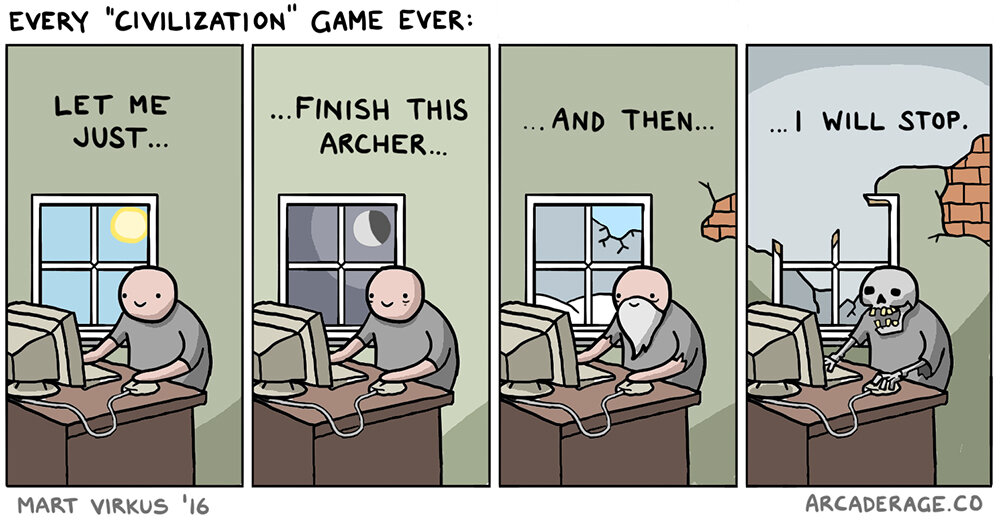
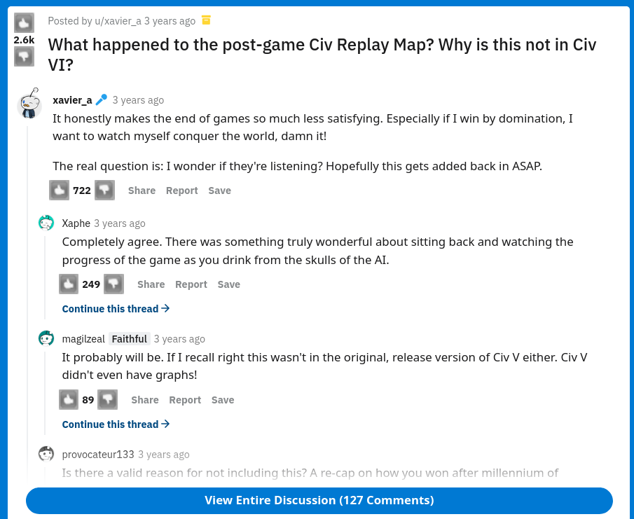
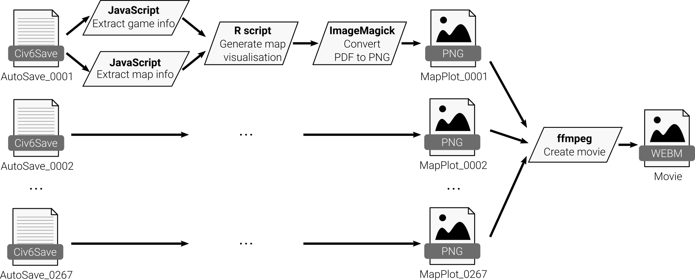

# Setting the stage for viash

The application domain of [viash] is not limited to just biomedical research. In this workshop, we will solve one of our pet peeves in a video game called Sid Meier's Civilization.

## Background on Civilization
Civilization is a series of six video strategy games where players oversee the development of a civilization, starting from the dawn of civilizations until present times. Not only is the series famous for having defined a lot of the game mechanics in the 4X genre (eXplore, eXpand, eXploit, and eXterminate), it is also frequently associated with the "One More Turn Syndrome".



## Post-game replay map
Multiplayer games can take a few hours to finish -- anywhere between 2 to 10 hours, depending on who you're playing with. 
That's why a perfect way of closing a session of Civilization V is by being able to watch a 'postgame map replay' of which owner owned which time at any given point in time.


However, for whatever reason, this feature did not make it in Civilization VI. This made a lot of people very angry and been widely regarded as a bad move. <!-- quoting Douglas Adams here -->



## Rendering post-game replay maps
At Data Intuitive, we're all about alleviating people's suffering, so we developed a few scripts for rendering a postgame video for Civilization VI using open-source tools. 
It works by letting the game automatically creates saves for every turn of the game (called 'autosaves'). An autosave contains all the information to resume the game from that point in time.
Since the information that we need is stored in a format, we need scripts to: 1. extract the information from the binary format (in JavaScript), 2. generate a map visualisation (in R), 3. convert all the visualisations into a video (with ImageMagick and ffmpeg).

You can see the general workflow for generating a postgame replay video in the diagram below. 



In the next sections, we briefly discuss how each component works, as it will be used later on in the workshop.

## Input files

Screenshot of Civ6Save files.

## `parse_header`: Extract game info

Setup:
```bash
npm install civ6-save-parser
```

Convert:
```bash
node /home/node/node_modules/civ6-save-parser/index.js data/AutoSave_0001.Civ6Save --simple > data/AutoSave_0001.yaml
```

## `parse_map`: Extract map info

Setup:
```bash
git clone https://github.com/rcannood/civ6save-editing.git
```

Convert:
```bash
node /home/node/civ6save-editing/scripts/savetomaptsv.js data/AutoSave_0001.Civ6Save data/AutoSave_0001
```

## `plot_map`: Generate map visualisation

Setup:
```R
install.packages(c("ggforce", "yaml", "bit64", "ggnewscale", "cowplot", "devtools"))
devtools::install("rcannood/civ6saves")
```

Execute:
```R
library(tidyverse)
library(ggforce)
library(civ6saves)
library(bit64)
library(cowplot)
library(yaml)
library(ggnewscale)

par <- list(
  yaml = "data/AutoSave_0001.yaml",
  tsv = "data/AutoSave_0001.tsv",
  output = "data/AutoSave_0001.pdf"
)

# read header information
map_data <- readr::read_lines(par$yaml)

# read map information
map_data$MAP <- read_tsv(par$tsv, col_types = cols(.default = "c")) 

# do some in between processing (omitted for the sake of this tutorial)
... 

# create plot
plot <-
  plot_empty_map(map_data) +
  ggforce::geom_regon(aes(fill = terrain_name), alpha = alpha) +
  geom_text(aes(label = "^"), tab_static %>% filter(terrain_form == "Hill"), alpha = alpha) +
  geom_text(aes(label = "^"), tab_static %>% filter(terrain_form == "Mountain"), fontface = "bold", alpha = alpha) +
  geom_segment(aes(x = xa, xend = xb, y = ya, yend = yb), colour = feature_palette[["River"]], rivers, size = 1, alpha = alpha) +
  ggforce::geom_regon(aes(r = civ6saves:::xy_ratio * .9), tab %>% filter(feature_name == "Ice"), fill = feature_palette[["Ice"]], alpha = .4) +
  labs(
    title = paste0("Turn ", map_data$GAME_TURN, " - ", tolower(gsub("MAPSIZE_", "", map_data$MAP_SIZE))),
    subtitle = paste0(players$leader_name, collapse = ", "),
    fill = "Terrain"
  )

# save map to file
ggsave(par$output, plot, width = 24, height = 13)
```

Some (actually, a lot) of code was omitted from the above script. You can view the full script at the [viash_docs](https://github.com/data-intuitive/viash_docs/blob/master/examples/civ6_postgame/src/civ6_save_renderer/plot_map/script.R) GitHub repository.


## `convert_plot`: Convert PDF to PNG

Setup:
```bash
sudo apt-get install imagemagick
```

Convert:
```bash
convert data/AutoSave_0001.pdf -flatten data/AutoSave_0001.png
```

## `combine_plots`: Create movie

Setup:
```bash
sudo apt-get install ffmpeg
```

Convert:
```bash
ffmpeg -framerate 4 -i "concat:data/AutoSave_0001.png|data/AutoSave_0002.png|..." -c:v libvpx-vp9 -pix_fmt yuva420p -y "data/Movie.webm"
```

## Enter viash, stage left

While we at Data Intuitive can now happily churn out postgame videos of all of our Civilization VI, installing the requirements on a different system is a hassle.
Because of the complicated software requirements, and because of its pipeline-like workflow, this application is serves as a perfect example of why and how to use [viash].


[viash]: https://www.data-intuitive.com/viash_docs
