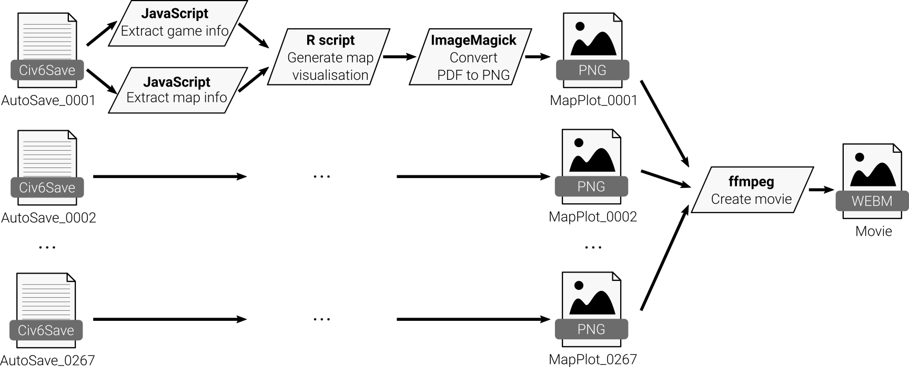
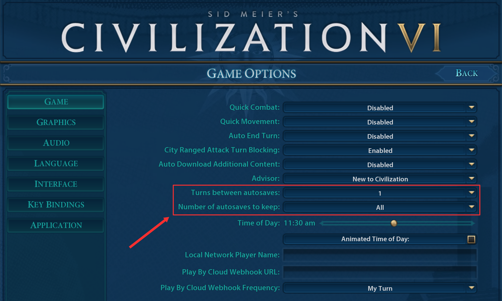
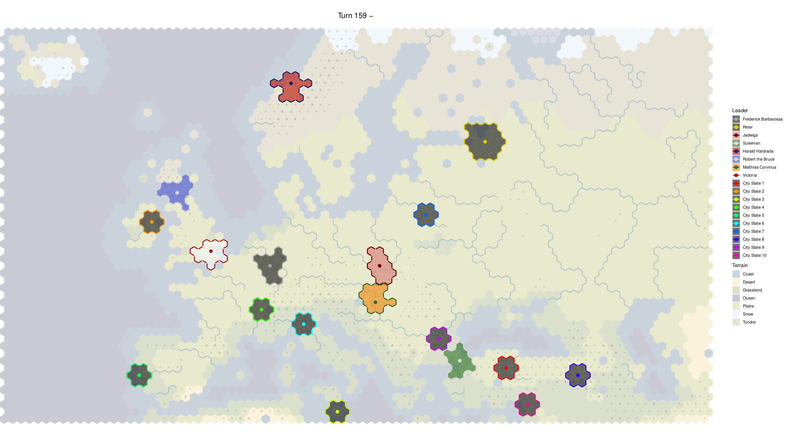

Setting the stage for viash
===========================

The application domain of
[viash](https://www.data-intuitive.com/viash_docs) is not limited to
just biomedical research. In this workshop, we will solve one of our pet
peeves in a video game called Sid Meier's Civilization.

Background on Civilization
--------------------------

Civilization is a series of six video strategy games where players
oversee the development of a civilization, starting from the dawn of
civilizations until present times. Not only is the series famous for
having defined a lot of the game mechanics in the 4X genre (eXplore,
eXpand, eXploit, and eXterminate), it is also frequently associated with
the "One More Turn Syndrome".


Post-game replay map
--------------------

Multiplayer games can take a few hours to finish -- anywhere between 2
to 10 hours, depending on who you're playing with. That's why a perfect
way of closing a session of Civilization V is by being able to watch a
'postgame map replay' of which owner owned which time at any given point
in time.


However, for whatever reason, this feature did not make it in
Civilization VI. This made a lot of people very angry and been widely
regarded as a bad move. `<!-- quoting Douglas Adams here -->`{=html}


Rendering post-game replay maps
-------------------------------

At Data Intuitive, we're all about alleviating people's suffering, so we
developed a few scripts for rendering a postgame video for Civilization
VI using open-source tools. It works by letting the game automatically
creates saves for every turn of the game (called 'autosaves'). An
autosave contains all the information to resume the game from that point
in time. Since the information that we need is stored in a format, we
need scripts to: 1. extract the information from the binary format (in
JavaScript), 2. generate a map visualisation (in R), 3. convert all the
visualisations into a video (with ImageMagick and ffmpeg).

You can see the general workflow for generating a postgame replay video
in the diagram below.



In the next sections, we briefly discuss how each component works, as it
will be used later on in the workshop.

Step 1: Generate input files
----------------------------

Start up Civilization VI and go into the settings menu. You need to
configure Civilization VI to create an autosave every turn, and to keep
all autosaves as normally only the 10 latest autosaves are kept.



Your first task in this workshop is to play a game of Civilization VI,
yay! See you in a few hours! Don't forget to come back for the remainder
of this workshop!

...

...

Just kidding. We did the fun part and already created autosaves for you.
If you check the `data` folder, you will see five autosave files.

``` {.bash}
ls -l data
```

    ## total 5048
    ## -rw-rw-r--. 1 rcannood rcannood  612404 Jan 26 10:42 AutoSave_0158.Civ6Save
    ## -rw-rw-r--. 1 rcannood rcannood 1061697 Jan 26 10:42 AutoSave_0159.Civ6Save
    ## -rw-rw-r--. 1 rcannood rcannood 1140352 Jan 26 10:42 AutoSave_0160.Civ6Save
    ## -rw-rw-r--. 1 rcannood rcannood 1164860 Jan 26 10:42 AutoSave_0161.Civ6Save
    ## -rw-rw-r--. 1 rcannood rcannood 1179409 Jan 26 10:42 AutoSave_0162.Civ6Save

Step 2, `parse_header`: Extract game info
-----------------------------------------

So how do we parse the binary Civ6Save data format? Luckily, by the
miracles of open-source software development, GitHub users Mike
"mrosack" Rosack and Tuomas "iqqmuT" Jaakola already developed a tool
for extracting which players are playing which civilizations. You can
install their software by running the following command.

Note that you do not need to install these commands yourself, as we will
see in a later part of the workshop how to do this more easily with
viash!

``` {.bash}
npm install civ6-save-parser
```

You can view which players are playing the game by running the following
command:

``` {.bash}
node node_modules/civ6-save-parser/index.js data/AutoSave_0159.Civ6Save --simple | head -20
```

    ## {
    ##   ACTORS: [
    ##     {
    ##       START_ACTOR: 4159575459,
    ##       ACTOR_NAME: 'CIVILIZATION_FREE_CITIES',
    ##       ACTOR_TYPE: 'CIVILIZATION_LEVEL_FREE_CITIES',
    ##       ACTOR_AI_HUMAN: 1,
    ##       LEADER_NAME: 'LEADER_FREE_CITIES'
    ##     },
    ##     {
    ##       SLOT_HEADER: 19,
    ##       ACTOR_NAME: 'CIVILIZATION_ARMAGH',
    ##       ACTOR_TYPE: 'CIVILIZATION_LEVEL_CITY_STATE',
    ##       ACTOR_AI_HUMAN: 1,
    ##       LEADER_NAME: 'LEADER_MINOR_CIV_ARMAGH'
    ##     },
    ##     {
    ##       START_ACTOR: 4058321742,
    ##       ACTOR_NAME: 'CIVILIZATION_BOLOGNA',
    ##       ACTOR_TYPE: 'CIVILIZATION_LEVEL_CITY_STATE',

The output is a json file, which you save as follows.

``` {.bash}
node node_modules/civ6-save-parser/index.js data/AutoSave_0159.Civ6Save --simple > data/AutoSave_0159.json
```

Step 3, `parse_map`: Extract map info
-------------------------------------

Alright, so we know which games are playing the game, but which tiles do
they own? As there are no ready to use npm packages available to do this
specific task, we had to write this functionality in JavaScript
ourselves. The scripts `helper.js` and `script.js` are based on work by
Lucien "lucienmaloney" Maloney on GitHub.

Some helper functions are defined in
[`helper.js`](src/civ6_save_renderer/parse_map/helper.js) (some code is
omitted for the sake of clarity). The `decompress()` function reads in
the binary data, while the `savetomap()` function responsible is for
parsing the relevant data about each time in a tabular format.

``` {.js}
const zlib = require('zlib');

/**
 * Output a decompressed buffer from the primary zlib zip of the .Civ6Save file
 * @param {Buffer} savefile
 * @return {Buffer} decompressed
 */
function decompress(savefile) {
  // ... omitted for the sake of clarity ...
}

/**
 * Convert compressed tile data in .Civ6Save file into json format
 * @param {buffer} savefile
 * @return {object} tiles
 */
function savetomap(savefile) {
  // ... omitted for the sake of clarity ...
}

module.exports = {
  decompress,
  savetomap
}
```

Reading in the map data and saving it as a tsv (tab-separated values)
table can be done by executing the scropt
[`script.js`](src/civ6_save_renderer/parse_map/script.js).

``` {.js}
let par = {
  'input': 'data/AutoSave_0159.Civ6Save',
  'output': 'data/AutoSave_0159.tsv'
}

// read helper libraries & functions
const fs = require("fs");
const helper = require("helper.js");

// read data from file
const json = helper.savetomap(fs.readFileSync(par["input"]));

// convert to tsv
const headers = Object.keys(json.tiles[0]);
const header = headers.join("\t") + "\n";
const lines = json.tiles.map(o => {
  return Object.values(o).map(b => JSON.stringify(b)).join("\t") + "\n";
});
const tsvLines = header + lines.join('')

// save to file
fs.writeFileSync(par["output"], tsvLines);
```

Note that at this stage, the imported data looks very raw. These are the
first 10 rows and 10 columns of the generated tsv.

  -------------------------------------------------------------------------------------------------------------------------------------------
  x   y   hex\_location   travel\_regions   connected\_regions   landmass     terrain      feature      natural\_wonder\_order   continent
  --- --- --------------- ----------------- -------------------- ------------ ------------ ------------ ------------------------ ------------
  0   0   1429433         65536             65536                4294967295   1204357597   4294967295   0                        4294967295

  1   0   1429488         65536             65536                4294967295   1204357597   4294967295   0                        4294967295

  2   0   1429543         65536             65536                4294967295   1204357597   4294967295   0                        4294967295

  3   0   1429598         65536             65536                4294967295   1204357597   4294967295   0                        4294967295

  4   0   1429653         65536             65536                4294967295   1204357597   4294967295   0                        4294967295

  5   0   1429708         65536             65536                4294967295   1204357597   4294967295   0                        4294967295

  6   0   1429763         65536             65536                4294967295   1204357597   4294967295   0                        4294967295

  7   0   1429818         65536             65536                4294967295   1204357597   4294967295   0                        4294967295

  8   0   1429873         65536             65536                4294967295   1204357597   4294967295   0                        4294967295

  9   0   1429928         65536             65536                4294967295   1204357597   4294967295   0                        4294967295
  -------------------------------------------------------------------------------------------------------------------------------------------

Step 4, `plot_map`: Generate map visualisation
----------------------------------------------

With both the game metadata in the yaml file and the map information in
the tsv file, we can finally go ahead and generate our first map
visualisation. The map is being generated with a software package called
'ggplot2' in R, but first we need to download all the required software
for it. Provided that you already have R installed, we need to run the
following code to install all of the dependencies. Setup:

``` {.r}
install.packages(c("ggforce", "yaml", "bit64", "ggnewscale", "cowplot", "devtools"))
devtools::install("rcannood/civ6saves")
```

Some helper functions are defined in
[`helper.R`](src/civ6_save_renderer/plot_map/helper.R) (some code is
omitted for the sake of clarity). The `read_header()` and `read_map()`
functions respectively read in the yaml and tsv files outputted in the
previous steps. The `make_map_plot()` function uses those two data
objects and generates a map view of the data provided.

``` {.r}
library(tidyverse)
requireNamespace("ggforce", quietly = TRUE)
requireNamespace("civ6saves", quietly = TRUE)
requireNamespace("bit64", quietly = TRUE)
requireNamespace("yaml", quietly = TRUE)
requireNamespace("ggnewscale", quietly = TRUE)

read_header <- function(yaml_file) {
  # read yaml file
  # ... omitted for the sake of clarity ...
}

read_map <- function(tsv_file) {
  # read tsv file
  # ... omitted for the sake of clarity ...
}

make_map_plot <- function(game_data, map_data) {
  # plot map with ggplot2
  # ... omitted for the sake of clarity ...
}
```

With [`script.R`](src/civ6_save_renderer/plot_map/script.R) we tie all
data inputs and helper functies to generate a PDF file of turn 159 of
the game we played for you.

``` {.r}
library(tidyverse)
library(cowplot)

source("helper.R")

par <- list(
  yaml = "data/AutoSave_0159.yaml",
  tsv = "data/AutoSave_0159.tsv",
  output = "data/AutoSave_0159.pdf"
)

# read data
game_data <- read_header(par$yaml)
map_data <- read_map(par$tsv)

# make visualisation
g <- make_map_plot(game_data, map_data)

# save map to file
gleg <- cowplot::get_legend(g)
gnoleg <- g + theme(legend.position = "none")
gout <- cowplot::plot_grid(gnoleg, gleg, rel_widths = c(8, 1))
ggsave(par$output, gout, width = 24, height = 13)
```

This is what the generated PDF file looks like.


Step 5, `convert_plot`: Convert PDF to PNG
------------------------------------------

Setup:

``` {.bash}
sudo apt-get install imagemagick
```

Convert:

``` {.bash}
convert data/AutoSave_0159.pdf -flatten data/AutoSave_0159.png
```

Step 6, `combine_plots`: Create movie
-------------------------------------

Setup:

``` {.bash}
sudo apt-get install ffmpeg
```

Convert:

``` {.bash}
ffmpeg -framerate 4 -i "concat:data/AutoSave_0159.png|data/AutoSave_0002.png|..." -c:v libvpx-vp9 -pix_fmt yuva420p -y "data/Movie.webm"
```

Enter viash, stage left
-----------------------

While we at Data Intuitive can now happily churn out postgame videos of
all of our Civilization VI, installing the requirements on a different
system is a hassle. Because of the complicated software requirements,
and because of its pipeline-like workflow, this application is serves as
a perfect example of why and how to use
[viash](https://www.data-intuitive.com/viash_docs).
