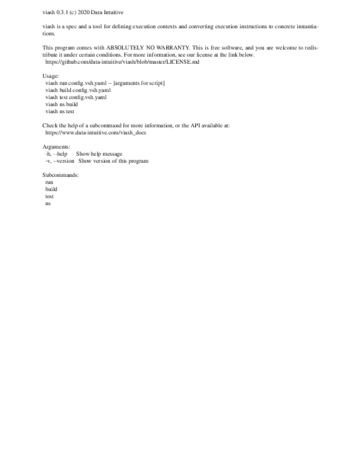

Introduction
============

With the information from the previous section, we will tackle two from
the components in detail in this section:

-   `convert_plot`
-   `combine_plots`

Both are explained in \[section 1\] above.

`convert_plot`
==============

`convert_plot` should convert a PDF map into a `.png` version.
\[ImageMagick\] is a suite of command line tools for UNIX-like systems
that can achieve this simply by running

    convert input.pdf -flatten output.png

Additional arguments can be provided, but are not required since
\[ImageMagick\] is pretty good at getting the defaults right.
\[ImageMagick\] will probably not be on everyone’s machine as a locally
installed tool, however. We would to enable the conversion from pdf to
png in a seamless way. Let’s use
[viash](https://github.com/data-intuitive/viash) for this…

The viash configuration
-----------------------

First of all, we will store all files related to one *component* in a
separate directory and give it the name of the component:

    > ls src/convert_plot
    config.vsh.yaml
    script.sh

Just like in the [viash](https://github.com/data-intuitive/viash) primer
(of the previous section) there is a
[viash](https://github.com/data-intuitive/viash) config
(`config.vsh.yaml`) and a script (`script.sh`). Let us take a closer
look at both of these:

`src/convert_plot/config.vsh.yaml`:

    functionality:
      name: convert_plot
      namespace: civ6_save_renderer
      description: Convert a plot from pdf to png.
      version: "1.0"
      authors:
        - name: Robrecht Cannoodt
          email: rcannood@gmail.com
          roles: [maintainer, author]
          props: {github: rcannood, orcid: 0000-0003-3641-729X}
      arguments:
        - name: "--input"
          alternatives: [-i]
          type: file
          required: true
          default: "input.pdf"
          must_exist: true
          description: "A PDF input file."
        - name: "--output"
          alternatives: [-o]
          type: file
          required: true
          default: "output.png"
          direction: output
          description: "Output path."
      resources:
        - type: bash_script
          path: script.sh
    platforms:
      - type: docker
        image: dpokidov/imagemagick
      - type: native

`src/convert_plot/script.sh`:

    #!/bin/bash

    convert "$par_input" -flatten "$par_output"

Let us dissect these two files step by step.

### Arguments

The script is not so much different from the CLI example we gave above.
The only difference is that 2 variables are used: `$par_input` and
`$par_output`. We use double quotes around the variables, this is a good
policy in general.

The argument `--input` defined in the config is automatically associated
with `$par_input` and likewise for `--output`. This makes it easy to
write scripts and immediately get a command-line parser for free when
using [viash](https://github.com/data-intuitive/viash).

If the script is more complicated than just this one instruction (it
usually is), it is possible to set default values for those parameters
in the script itself. This way, the script can be developed on its own
without requiring [viash](https://github.com/data-intuitive/viash)
directly. This can be achieved by including the following code block at
the top of the file. This syntax is similar but slightly different
depending on the scripting lanuage used.

    ## VIASH START
    par_input=input.pdf
    par_output=output.png
    ## VIASH END

If we focus on `--input` for a second, we notice the following
attributes:

-   `-i` is a (short) alternative for the longer `--input`
-   The value for this argument is of type `file` which means it’s
    either a file or a directory.
-   With `required: true` we make this argument a mandatory one
-   The default value for the argument is `input.pdf`
-   For argument of type file like this one, we can ask
    [viash](https://github.com/data-intuitive/viash) to check if the
    file/directory exists prior to running.
-   The `description` attribute contains a human-readable description of
    this argument/parameter.

Similar attributes can be found for `--output` with one difference:

-   `direction: output` denotes that this argument denotes an output
    file/option.

In fact, `--input` also has a (hidden) `direction: input` associated to
it by default.

### Resources

We’ve covered how to specify resources earlier in the previous section.
Suffice to say here that we point to a bash script that contains the
actual command-line instruction.

### Platforms

Two platforms are defined in the present case: a Docker one and a native
one. We point the Docker platform to an [existing Docker
image](https://hub.docker.com/r/dpokidov/imagemagick/) available on
Docker Hub.

Building the executable
-----------------------

Building an executable can be done just like before. We assume
ImageMagick is not installed on the local system and thus build the
Docker version:

    > viash build src/convert_plot/config.vsh.yaml -o bin/ -p docker

We specify the `docker` platform explicitly although that is not really
necessary because of the order of the platforms in the viash config. The
resulting script is stored under `bin` relative to the current working
directory.

A second file is written next to the executable: `viash.yaml`. This file
contains (almost) all information contained in the original config file,
including a serialized version of the script to run. `viash.yaml` aims
at providing the ability to reproduce the original viash configuration
but also to actually `viash run` that `viash.yaml` file. Such
functionality is called
[idempotence](https://en.wikipedia.org/wiki/Idempotence).

`bin/viash.yaml`:

    functionality:
      name: "convert_plot"
      version: "1.0"
      authors:
      - name: "Robrecht Cannoodt"
        email: "rcannood@gmail.com"
        roles:
        - "maintainer"
        - "author"
        props:
          github: "rcannood"
          orcid: "0000-0003-3641-729X"
      arguments:
      - type: "file"
        name: "--input"
        alternatives:
        - "-i"
        description: "A PDF input file."
        default: "input.pdf"
        must_exist: true
        required: true
        direction: "Input"
        multiple: false
        multiple_sep: ":"
      - type: "file"
        name: "--output"
        alternatives:
        - "-o"
        description: "Output path."
        default: "output.png"
        must_exist: false
        required: true
        direction: "Output"
        multiple: false
        multiple_sep: ":"
      resources:
      - type: "bash_script"
        text: |
          #!/usr/bin/env bash
          
          ##########################
          #    convert_plot 1.0    #
          ##########################
          
          # This wrapper script is auto-generated by viash 0.3.1 and is thus a derivative
          # work thereof. This software comes with ABSOLUTELY NO WARRANTY from Data
          # Intuitive.  The component may contain files which fall under a different
          # license. The authors of this component should specify the license in the
          # header of such files, or include a separate license file detailing the
          # licenses of all included files.
          #
          # Component authors:
          # * Robrecht Cannoodt <rcannood@gmail.com> (maintainer, author) {github: rcannood, orcid: 0000-0003-3641-729X}
          
          set -e
          
          if [ -z "$VIASH_TEMP" ]; then
            VIASH_TEMP=/tmp
          fi
          
          # define helper functions
          # ViashQuote: put quotes around non flag values
          # $1     : unquoted string
          # return : possibly quoted string
          # examples:
          #   ViashQuote --foo      # returns --foo
          #   ViashQuote bar        # returns 'bar'
          #   Viashquote --foo=bar  # returns --foo='bar'
          function ViashQuote {
            if [[ "$1" =~ ^-+[a-zA-Z0-9_\-]+=.+$ ]]; then
              echo "$1" | sed "s#=\(.*\)#='\1'#"
            elif [[ "$1" =~ ^-+[a-zA-Z0-9_\-]+$ ]]; then
              echo "$1"
            else
              echo "'$1'"
            fi
          }
          # ViashRemoveFlags: Remove leading flag
          # $1     : string with a possible leading flag
          # return : string without possible leading flag
          # examples:
          #   ViashRemoveFlags --foo=bar  # returns bar
          function ViashRemoveFlags {
            echo "$1" | sed 's/^--*[a-zA-Z0-9_\-]*=//'
          }
          # ViashSourceDir: return the path of a bash file, following symlinks
          # usage   : ViashSourceDir ${BASH_SOURCE[0]}
          # $1      : Should always be set to ${BASH_SOURCE[0]}
          # returns : The absolute path of the bash file
          function ViashSourceDir {
            SOURCE="$1"
            while [ -h "$SOURCE" ]; do
              DIR="$( cd -P "$( dirname "$SOURCE" )" >/dev/null 2>&1 && pwd )"
              SOURCE="$(readlink "$SOURCE")"
              [[ $SOURCE != /* ]] && SOURCE="$DIR/$SOURCE"
            done
            cd -P "$( dirname "$SOURCE" )" >/dev/null 2>&1 && pwd
          }
          
          # find source folder of this component
          VIASH_RESOURCES_DIR=`ViashSourceDir ${BASH_SOURCE[0]}`
          VIASH_EXEC_MODE="run"
          
          # ViashDockerFile: print the dockerfile to stdout
          # return : dockerfile required to run this component
          # examples:
          #   ViashDockerFile
          function ViashDockerfile {
            :
          }
          # ViashDockerBuild: ...
          function ViashDockerBuild {
            ViashDockerPull $1
          }
          
          # ViashSetup: ...
          function ViashSetup {
            ViashDockerSetup dpokidov/imagemagick $VIASH_DOCKER_SETUP_STRATEGY
          }
          
          
          # ViashHelp: Display helpful explanation about this executable
          function ViashHelp {
             echo "Convert a plot from pdf to png."
             echo
             echo "Options:"
              echo "    -i file, --input=file"
              echo "        type: file, required parameter, default: input.pdf"
              echo "        A PDF input file."
              echo ""
              echo "    -o file, --output=file"
              echo "        type: file, required parameter, default: output.png"
              echo "        Output path."
              echo ""
          }
          ######## Helper functions for setting up Docker images for viash ########
          
          
          # ViashDockerRemoteTagCheck: check whether a Docker image is available 
          # on a remote. Assumes `docker login` has been performed, if relevant.
          #
          # $1                  : image identifier with format `[registry/]image[:tag]`
          # exit code $?        : whether or not the image was found
          # examples:
          #   ViashDockerRemoteTagCheck python:latest
          #   echo $?                                     # returns '0'
          #   ViashDockerRemoteTagCheck sdaizudceahifu
          #   echo $?                                     # returns '1'
          function ViashDockerRemoteTagCheck {
            docker manifest inspect $1 > /dev/null 2> /dev/null
          }
          
          # ViashDockerLocalTagCheck: check whether a Docker image is available locally
          #
          # $1                  : image identifier with format `[registry/]image[:tag]`
          # exit code $?        : whether or not the image was found
          # examples:
          #   docker pull python:latest
          #   ViashDockerLocalTagCheck python:latest
          #   echo $?                                     # returns '0'
          #   ViashDockerLocalTagCheck sdaizudceahifu
          #   echo $?                                     # returns '1'
          function ViashDockerLocalTagCheck {
            [ -n "$(docker images -q $1)" ]
          }
          
          # ViashDockerPull: pull a Docker image
          #
          # $1                  : image identifier with format `[registry/]image[:tag]`
          # exit code $?        : whether or not the image was found
          # examples:
          #   ViashDockerPull python:latest
          #   echo $?                                     # returns '0'
          #   ViashDockerPull sdaizudceahifu
          #   echo $?                                     # returns '1'
          function ViashDockerPull {
            echo "> docker pull $1"
            docker pull $1 && return 0 || return 1
          }
          
          # ViashDockerPullElseBuild: pull a Docker image, else build it
          #
          # $1                  : image identifier with format `[registry/]image[:tag]`
          # examples:
          #   ViashDockerPullElseBuild mynewcomponent
          function ViashDockerPullElseBuild {
            set +e
            ViashDockerPull $1
            out=$?
            set -e
            if [ $out -ne 0 ]; then
              ViashDockerBuild $@
            fi
          }
          
          # ViashDockerSetup: create a Docker image, according to specified docker setup strategy
          #
          # $1                  : image identifier with format `[registry/]image[:tag]`
          # $2                  : docker setup strategy, see DockerSetupStrategy.scala
          # ViashDockerBuild    : a Bash function which builds a docker image, takes image identifier as argument.
          # examples:
          #   ViashDockerPullElseBuild mynewcomponent alwaysbuild
          function ViashDockerSetup {
            VSHD_ID="$1"
            VSHD_STRAT="$2"
            if [ "$VSHD_STRAT" == "alwaysbuild" -o "$VSHD_STRAT" == "build" ]; then
              ViashDockerBuild $VSHD_ID --no-cache
            elif [ "$VSHD_STRAT" == "alwayspull" -o "$VSHD_STRAT" == "pull" ]; then
              ViashDockerPull $VSHD_ID
            elif [ "$VSHD_STRAT" == "alwayspullelsebuild" -o "$VSHD_STRAT" == "pullelsebuild" ]; then
              ViashDockerPullElseBuild $VSHD_ID --no-cache
            elif [ "$VSHD_STRAT" == "alwayspullelsecachedbuild" -o "$VSHD_STRAT" == "pullelsecachedbuild" ]; then
              ViashDockerPullElseBuild $VSHD_ID
            elif [ "$VSHD_STRAT" == "alwayscachedbuild" -o "$VSHD_STRAT" == "cachedbuild" ]; then
              ViashDockerBuild $VSHD_ID
            elif [ "$VSHD_STRAT" == "donothing" -o "$VSHD_STRAT" == "meh" ]; then
              echo "Skipping setup."
            elif [[ "$VSHD_STRAT" =~ ^ifneedbe ]]; then
              ViashDockerLocalTagCheck $VSHD_ID
              if [ $? -eq 0 ]; then
                echo "Image $VSHD_ID already exists"
              elif [ "$VSHD_STRAT" == "ifneedbebuild" ]; then
                ViashDockerBuild $VSHD_ID --no-cache
              elif [ "$VSHD_STRAT" == "ifneedbecachedbuild" ]; then
                ViashDockerBuild $VSHD_ID
              elif [ "$VSHD_STRAT" == "ifneedbepull" ]; then
                ViashDockerPull $VSHD_ID
              elif [ "$VSHD_STRAT" == "ifneedbepullelsebuild" ]; then
                ViashDockerPullElseBuild $VSHD_ID --no-cache
              elif [ "$VSHD_STRAT" == "ifneedbepullelsecachedbuild" ]; then
                ViashDockerPullElseBuild $VSHD_ID
              else
                echo "Unrecognised Docker strategy: $VSHD_STRAT"
              fi
            else
              echo "Unrecognised Docker strategy: $VSHD_STRAT"
            fi
          }
          
          ######## End of helper functions for setting up Docker images for viash ########
          # initialise variables
          VIASH_DOCKER_SETUP_STRATEGY='alwaysbuild'
          # ViashAbsolutePath: generate absolute path from relative path
          # borrowed from https://stackoverflow.com/a/21951256
          # $1     : relative filename
          # return : absolute path
          # examples:
          #   ViashAbsolutePath some_file.txt   # returns /path/to/some_file.txt
          #   ViashAbsolutePath /foo/bar/..     # returns /foo
          function ViashAbsolutePath {
            local thePath
            if [[ ! "$1" =~ ^/ ]]; then
              thePath="$PWD/$1"
            else
              thePath="$1"
            fi
            echo "$thePath" | (
              IFS=/
              read -a parr
              declare -a outp
              for i in "${parr[@]}"; do
                case "$i" in
                ''|.) continue ;;
                ..)
                  len=${#outp[@]}
                  if ((len==0)); then
                    continue
                  else
                    unset outp[$((len-1))]
                  fi
                  ;;
                *)
                  len=${#outp[@]}
                  outp[$len]="$i"
                ;;
                esac
              done
              echo /"${outp[*]}"
            )
          }
          # ViashAutodetectMount: auto configuring docker mounts from parameters
          # $1                  : The parameter value
          # returns             : New parameter
          # $VIASH_EXTRA_MOUNTS : Added another parameter to be passed to docker
          # examples:
          #   ViashAutodetectMount /path/to/bar      # returns '/viash_automount/path/to/bar'
          #   ViashAutodetectMountArg /path/to/bar   # returns '-v /path/to:/viash_automount/path/to'
          function ViashAutodetectMount {
            abs_path=$(ViashAbsolutePath "$1")
            if [ -d "$abs_path" ]; then
              mount_source="$abs_path"
              base_name=""
            else
              mount_source=`dirname "$abs_path"`
              base_name=`basename "$abs_path"`
            fi
            mount_target="/viash_automount$mount_source"
            echo "$mount_target/$base_name"
          }
          function ViashAutodetectMountArg {
            abs_path=$(ViashAbsolutePath "$1")
            if [ -d "$abs_path" ]; then
              mount_source="$abs_path"
              base_name=""
            else
              mount_source=`dirname "$abs_path"`
              base_name=`basename "$abs_path"`
            fi
            mount_target="/viash_automount$mount_source"
            echo "-v \"$mount_source:$mount_target\""
          }
          # ViashExtractFlags: Retain leading flag
          # $1     : string with a possible leading flag
          # return : leading flag
          # examples:
          #   ViashExtractFlags --foo=bar  # returns --foo
          function ViashExtractFlags {
            echo $1 | sed 's/=.*//'
          }
          # initialise variables
          VIASH_EXTRA_MOUNTS=''
          
          # initialise array
          VIASH_POSITIONAL_ARGS=''
          
          while [[ $# -gt 0 ]]; do
              case "$1" in
                  -h|--help)
                      ViashHelp
                      exit;;
                  ---setup)
                      VIASH_EXEC_MODE="setup"
                      shift 1
                      ;;
                  --input)
                      VIASH_PAR_INPUT="$2"
                      shift 2
                      ;;
                  --input=*)
                      VIASH_PAR_INPUT=$(ViashRemoveFlags "$1")
                      shift 1
                      ;;
                  -i)
                      VIASH_PAR_INPUT="$2"
                      shift 2
                      ;;
                  --output)
                      VIASH_PAR_OUTPUT="$2"
                      shift 2
                      ;;
                  --output=*)
                      VIASH_PAR_OUTPUT=$(ViashRemoveFlags "$1")
                      shift 1
                      ;;
                  -o)
                      VIASH_PAR_OUTPUT="$2"
                      shift 2
                      ;;
                  ---dss|---docker_setup_strategy)
                      VIASH_EXEC_MODE="setup"
                      VIASH_DOCKER_SETUP_STRATEGY="$2"
                      shift 2
                      ;;
                  ---docker_setup_strategy=*)
                      VIASH_EXEC_MODE="setup"
                      VIASH_DOCKER_SETUP_STRATEGY=$(ViashRemoveFlags "$2")
                      shift 1
                      ;;
                  ---dockerfile)
                      ViashDockerfile
                      exit 0
                      ;;
                  ---v|---volume)
                      VIASH_EXTRA_MOUNTS="$VIASH_EXTRA_MOUNTS -v "$2""
                      shift 2
                      ;;
                  ---volume=*)
                      VIASH_EXTRA_MOUNTS="$VIASH_EXTRA_MOUNTS -v $(ViashRemoveFlags "$2")"
                      shift 1
                      ;;
                  ---debug)
                      echo "+ docker run --entrypoint=bash -i --rm -v "$(pwd)":/pwd --workdir /pwd -t dpokidov/imagemagick"
                      docker run --entrypoint=bash -i --rm -v "$(pwd)":/pwd --workdir /pwd -t dpokidov/imagemagick
                      exit 0
                      ;;
                  *)    # positional arg or unknown option
                      # since the positional args will be eval'd, can we always quote, instead of using ViashQuote
                      VIASH_POSITIONAL_ARGS="$VIASH_POSITIONAL_ARGS '$1'"
                      shift # past argument
                      ;;
              esac
          done
          
          if [ "$VIASH_EXEC_MODE" == "setup" ]; then
            ViashSetup
            exit 0
          fi
          
          # parse positional parameters
          eval set -- $VIASH_POSITIONAL_ARGS
          
          
          
          # check whether required parameters exist
          if [ -z "$VIASH_PAR_INPUT" ]; then
            echo '--input' is a required argument. Use "--help" to get more information on the parameters.
            exit 1
          fi
          if [ -z "$VIASH_PAR_OUTPUT" ]; then
            echo '--output' is a required argument. Use "--help" to get more information on the parameters.
            exit 1
          fi
          
          
          # check whether required files exist
          if [ ! -z "$VIASH_PAR_INPUT" ] && [ ! -e "$VIASH_PAR_INPUT" ]; then
            echo "File '$VIASH_PAR_INPUT' does not exist."
            exit 1
          fi
          
          # detect volumes from file arguments
          if [ ! -z "$VIASH_PAR_INPUT" ]; then
            VIASH_EXTRA_MOUNTS="$VIASH_EXTRA_MOUNTS $(ViashAutodetectMountArg "$VIASH_PAR_INPUT")"
            VIASH_PAR_INPUT=$(ViashAutodetectMount "$VIASH_PAR_INPUT")
          fi
          if [ ! -z "$VIASH_PAR_OUTPUT" ]; then
            VIASH_EXTRA_MOUNTS="$VIASH_EXTRA_MOUNTS $(ViashAutodetectMountArg "$VIASH_PAR_OUTPUT")"
            VIASH_PAR_OUTPUT=$(ViashAutodetectMount "$VIASH_PAR_OUTPUT")
          fi
          
          # Always mount the resource directory
          VIASH_EXTRA_MOUNTS="$VIASH_EXTRA_MOUNTS $(ViashAutodetectMountArg "$VIASH_RESOURCES_DIR")"
          VIASH_RESOURCES_DIR=$(ViashAutodetectMount "$VIASH_RESOURCES_DIR")
          
          # Always mount the VIASH_TEMP directory
          VIASH_EXTRA_MOUNTS="$VIASH_EXTRA_MOUNTS $(ViashAutodetectMountArg "$VIASH_TEMP")"
          VIASH_TEMP=$(ViashAutodetectMount "$VIASH_TEMP")
          
          # change file ownership
          function viash_perform_chown {
            
            if [ ! -z "$VIASH_PAR_OUTPUT" ]; then
              eval docker run --entrypoint=chown -i --rm $VIASH_EXTRA_MOUNTS dpokidov/imagemagick "$(id -u):$(id -g)" -R "$VIASH_PAR_OUTPUT"
            fi
          }
          trap viash_perform_chown EXIT
          
          
          cat << VIASHEOF | eval docker run --entrypoint=bash -i --rm $VIASH_EXTRA_MOUNTS dpokidov/imagemagick
          set -e
          tempscript=\$(mktemp "$VIASH_TEMP/viash-run-convert_plot-XXXXXX")
          function clean_up {
            rm "\$tempscript"
          }
          trap clean_up EXIT
          cat > "\$tempscript" << 'VIASHMAIN'
          # The following code has been auto-generated by Viash.
          par_input='$VIASH_PAR_INPUT'
          par_output='$VIASH_PAR_OUTPUT'
          
          resources_dir="$VIASH_RESOURCES_DIR"
          
          #!/bin/bash
          
          convert "\$par_input" -flatten "\$par_output"
          VIASHMAIN
          PATH="$VIASH_RESOURCES_DIR:\$PATH"
          
          bash "\$tempscript"
          
          VIASHEOF
          

        dest: "convert_plot"
        is_executable: true
      description: "Convert a plot from pdf to png."
      tests: []
    platform:
      type: "docker"
      id: "docker"
      image: "dpokidov/imagemagick"
      resolve_volume: "Automatic"
      chown: true
      setup_strategy: "alwaysbuild"
      setup: []
    platforms: []
    info:
      config: "src/convert_plot/config.vsh.yaml"
      platform: "docker"
      output: "bin/"
      executable: "bin/convert_plot"
      viash_version: "0.3.1"
      git_commit: "b69d3a5c12c2717325fb6ad974e81a8e8cdd437c"
      git_remote: "git@github.com:data-intuitive/viash_workshop_1.git"

We ask the generated executable to run the necessary setup. In this
case, it means *pulling* the appropriate docker image from Docker Hub.

    > bin/convert_plot ---setup
    > docker pull dpokidov/imagemagick
    Using default tag: latest
    latest: Pulling from dpokidov/imagemagick
    Digest: sha256:6749db04ffa5eac1cbe77566af02463f040028fef525b767dc98e06023e6cdf8
    Status: Image is up to date for dpokidov/imagemagick:latest
    docker.io/dpokidov/imagemagick:latest

We can retrieve the *help*

    > bin/convert_plot -h
    Convert a plot from pdf to png.

    Options:
        -i file, --input=file
            type: file, required parameter, default: input.pdf
            A PDF input file.

        -o file, --output=file
            type: file, required parameter, default: output.png
            Output path.

Running the executable
----------------------

Now that everything is up and running, we can start converting images.
Let us first generate a simple PDF file with the help of
[viash](https://github.com/data-intuitive/viash). We start by preparing
a directory to store the data:

    > mkdir -p data/

And then use a simple mechanism to create a very basis PDF from the
[viash](https://github.com/data-intuitive/viash) help output:

    > viash -h | groff -mom -T pdf > data/viash.pdf

This generates `data/viash.pdf` in order to verify if our conversion
step works:

    > bin/convert_plot -i data/viash.pdf -o data/viash.png
    convert: profile 'icc': 'RGB ': RGB color space not permitted on grayscale PNG `/viash_automount/home/rcannood/workspace/di/viash_workshop_1/030-ViashVersion/data/viash.png' @ warning/png.c/MagickPNGWarningHandler/1748.

Ok, so this should work now:

<!-- See: https://www.xaprb.com/blog/how-to-style-images-with-markdown/ -->

Without viash
-------------

Please note that in the above example, the input file and output file
reside on the host image while the conversion process is running inside
a Docker container. If we would want to achieve this without
[viash](https://github.com/data-intuitive/viash), we would need
something like this:

    docker run -i -v `pwd`:/mount dpokidov/ImageMagick /mount/data/viash.pdf -flatten /mount/data/viash.png

This requires some mental bookkeeping to understand the difference
between the host’s file system and the one inside the container. It also
requires one to know how the container’s commands are parsed. In this
case the `convert` command from ImageMagick is automatically called with
the options we provide. But that may be different for every container
and depends on the contents of the `Dockerfile`.

Also, while the above explicit `docker` command achieves our aim, it
does not fully cover the use-case that we tackle using
[viash](https://github.com/data-intuitive/viash). For a correct
comparison, we would have to run our custom script in the container. But
then, we would have to make a few updates:

1.  Include command-line argument parsing in the `script.sh` file so
    that we can provide input and output parameters to it.
2.  *Install* the modified `script.sh` file inside the container, or
    somehow *mount* the location of the executable inside the container
    such that it can be found.

In other words:

> Using [viash](https://github.com/data-intuitive/viash) all this is
> greatly simplified and wrapped in one executable, command-line parsing
> comes for free.

`combine_plots`
===============

This *component* combines a number of `png` files in to one single movie
(`webm` format).

The viash configuration
-----------------------

First of all, we will store all files related to one *component* in a
separate directory and give it the name of the component:

    > ls src/combine_plots
    config.vsh.yaml
    script.sh

Again, there is a [viash](https://github.com/data-intuitive/viash)
config (`config.vsh.yaml`) and a script (`script.sh`). Let us take a
closer look at both of these:

`src/combine_plots/config.vsh.yaml`:

    functionality:
      name: combine_plots
      namespace: civ6_save_renderer
      description: Combine multiple images into a movie using ffmpeg.
      version: "1.0"
      authors:
        - name: Robrecht Cannoodt
          email: rcannood@gmail.com
          roles: [maintainer, author]
          props: {github: rcannood, orcid: 0000-0003-3641-729X}
      arguments:
        - name: "--input"
          alternatives: [-i]
          type: file
          required: true
          default: "plot1.png:plot2.png"
          must_exist: true
          multiple: true
          description: A list of images.
        - name: "--output"
          alternatives: [-o]
          type: file
          required: true
          default: "output.webm"
          direction: output
          description: A path to output the movie to.
        - name: "--framerate"
          alternatives: [-f]
          type: integer
          default: 4
          description: Number of frames per second.
      resources:
        - type: bash_script
          path: script.sh
    platforms:
      - type: docker
        image: jrottenberg/ffmpeg
      - type: native

`src/combine_plots/script.sh`:

    #!/bin/bash

    inputs=$(echo $par_input | tr ':' '|')
    ffmpeg -framerate $par_framerate -i "concat:$inputs" -c:v libvpx-vp9 -pix_fmt yuva420p -y "$par_output"

### Arguments

This component is similar to the one above with one major difference: we
need to specify *multiple* input file names. This can easily be done
with [viash](https://github.com/data-intuitive/viash) by specifying
`multiple: true` in the configuration of the `--input` argument. By
default [viash](https://github.com/data-intuitive/viash) will pass the
value of this option to the wrapped script depending on the type of
script. In the case of `bash`, this is simply a string with a delimiter
for the individual values (`:` by default). For `Python` and `R` etc.,
it is passed as a simple collection (list, array).

The script that is run converts the following value `--input`:

    path1:path2:path3

into

    -i path1 -i path2 -o path3

by means of the `sed` instruction.

The rest is only a matter of getting the command line parameters for
`ffmpeg` right.

### Platforms

Two platforms are again defined in the present case: a Docker one and a
native one. We point the Docker platform to an [existing Docker
image](https://hub.docker.com/r/jrottenbergj/ffmpeg/) available on
Docker Hub.

Running the executable
----------------------

Let us create one additional `png` file by using the same *technique* as
before, this time creating a PDF file with just the output of an empty
[viash](https://github.com/data-intuitive/viash) run.

    > viash | groff -mom -T pdf > data/viash1.pdf

This generates `data/viash.pdf` in order to verify if our conversion
step works:

    > bin/convert_plot -i data/viash1.pdf -o data/viash1.png
    convert: profile 'icc': 'RGB ': RGB color space not permitted on grayscale PNG `/viash_automount/home/rcannood/workspace/di/viash_workshop_1/030-ViashVersion/data/viash1.png' @ warning/png.c/MagickPNGWarningHandler/1748.

Ok, so this should work now:

We now have 2 `png` files and should be able to run our `combine_plots`
component. But first, we’ll build the executable:

    > viash build src/combine_plots/config.vsh.yaml -o bin/ -p docker

Make sure the container is present:

    > bin/combine_plots ---setup
    > docker pull jrottenberg/ffmpeg
    Using default tag: latest
    latest: Pulling from jrottenberg/ffmpeg
    Digest: sha256:21eb739725c43bd7187982e5fa4b5371b495d1d1f6f61ae1719ca794817f8641
    Status: Image is up to date for jrottenberg/ffmpeg:latest
    docker.io/jrottenberg/ffmpeg:latest

And than executing the executable:

    > bin/combine_plots --input data/viash.png:data/viash1.png --output data/output.webm --framerate 1
    ffmpeg version 4.1 Copyright (c) 2000-2018 the FFmpeg developers
      built with gcc 5.4.0 (Ubuntu 5.4.0-6ubuntu1~16.04.11) 20160609
      configuration: --disable-debug --disable-doc --disable-ffplay --enable-shared --enable-avresample --enable-libopencore-amrnb --enable-libopencore-amrwb --enable-gpl --enable-libass --enable-libfreetype --enable-libvidstab --enable-libmp3lame --enable-libopenjpeg --enable-libopus --enable-libtheora --enable-libvorbis --enable-libvpx --enable-libx265 --enable-libxvid --enable-libx264 --enable-nonfree --enable-openssl --enable-libfdk_aac --enable-libkvazaar --enable-libaom --extra-libs=-lpthread --enable-postproc --enable-small --enable-version3 --extra-cflags=-I/opt/ffmpeg/include --extra-ldflags=-L/opt/ffmpeg/lib --extra-libs=-ldl --prefix=/opt/ffmpeg
      libavutil      56. 22.100 / 56. 22.100
      libavcodec     58. 35.100 / 58. 35.100
      libavformat    58. 20.100 / 58. 20.100
      libavdevice    58.  5.100 / 58.  5.100
      libavfilter     7. 40.101 /  7. 40.101
      libavresample   4.  0.  0 /  4.  0.  0
      libswscale      5.  3.100 /  5.  3.100
      libswresample   3.  3.100 /  3.  3.100
      libpostproc    55.  3.100 / 55.  3.100
    Input #0, png_pipe, from 'concat:/viash_automount/home/rcannood/workspace/di/viash_workshop_1/030-ViashVersion/data/viash.png|/viash_automount/home/rcannood/workspace/di/viash_workshop_1/030-ViashVersion/data/viash1.png':
      Duration: N/A, bitrate: N/A
        Stream #0:0: Video: png, gray(pc), 612x792 [SAR 72:72 DAR 17:22], 1 tbr, 1 tbn, 1 tbc
    Stream mapping:
      Stream #0:0 -> #0:0 (png (native) -> vp9 (libvpx-vp9))
    Press [q] to stop, [?] for help
    [libvpx-vp9 @ 0x13d7740] v1.8.0
    Output #0, webm, to '/viash_automount/home/rcannood/workspace/di/viash_workshop_1/030-ViashVersion/data/output.webm':
      Metadata:
        encoder         : Lavf58.20.100
        Stream #0:0: Video: vp9 (libvpx-vp9), yuva420p, 612x792 [SAR 1:1 DAR 17:22], q=-1--1, 200 kb/s, 1 fps, 1k tbn, 1 tbc
        Metadata:
          encoder         : Lavc58.35.100 libvpx-vp9
        Side data:
          cpb: bitrate max/min/avg: 0/0/0 buffer size: 0 vbv_delay: -1
    frame=    2 fps=0.0 q=0.0 Lsize=      19kB time=00:00:01.00 bitrate= 151.6kbits/s speed=4.62x    
    video:18kB audio:0kB subtitle:0kB other streams:0kB global headers:0kB muxing overhead: 4.848786%

The result this simple *video* that can hardly be called a video:

In the next section, we will cover *all* the components of the postgame
pipeline one by one.
