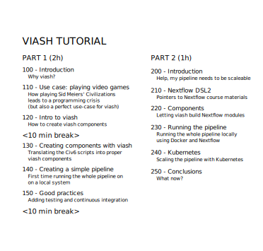

Introduction
================
Data Intuitive
Tuesday - January 26, 2021

  - [Use cases for viash](#use-cases-for-viash)
  - [How viash works](#how-viash-works)
  - [Outline of this tutorial](#outline-of-this-tutorial)

This tutorial is all about viash\! What is viash?

viash is software that helps you turn a script into a reusable
component, which you can use as a standalone executable or as part of a
pipeline.

## Use cases for viash

Phew\! What does that mean? Here are a few typical use cases have
already caused indescribable frustrations among software developers, but
can be solved quite easily by using viash.

  - You developed a Jupyter notebook report for a data analysis. You
    wish to share it with your colleague, only to spend two hours
    installing your Conda stack on their laptop.

  - You want to combine a couple of tools in a pipeline and every tool
    has specific requirements on how they should be run. Even worse:
    some requirements might directly conflict with each other.

  - Your next data analysis project is very similar to the previous
    project, so you copy and paste the source code. Unfortunately, you
    detect a bug in some of your code, so now you need to go back and
    fix the same bug in all the different projects.

  - You want to look back at a data analysis you performed two years
    ago. Unfortunately, the software you used back then is not supported
    anymore, or the newest version produces totally different results.

## How viash works

By providing some meta-data regarding its functionality and the platform
on which you want to run the software, viash can help you:

  - wrap your script (Bash/R/Python/JavaScript/Scala) as an executable
    with a CLI and `--help` functionality,

  - seamlessly execute your component natively on the host platform or
    in a Docker container,

  - combine multiple components in a Nextflow pipeline, and

  - unit-test your component to ensure that it works at all times.

## Outline of this tutorial

