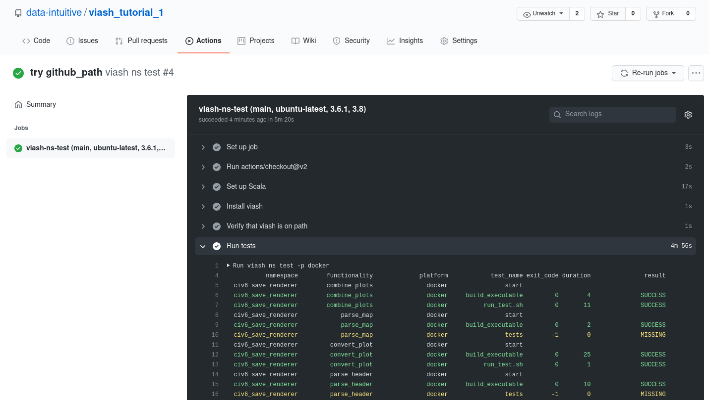

```{r setup, include = FALSE}
# set default chunk options
knitr::opts_chunk$set(
  echo = TRUE,
  comment = "",
  collapse = TRUE,
  prompt = TRUE
)

knitr::opts_knit$set(root.dir = '..')
```

In the previous sections, we wrote some software components and strung them together in Bash to form a simple pipeline. While these components work right now, they might soon break for any of the following reasons:

* While adding a feature to one of the components, a developer accidentally introduced a bug.

* A small change in the output of one component causes the other component to break.

* Breaking changes were introduced in the latest version of Python. The component's script needs to be updated or should be set to using an older version of Python.

If your component is actively developed, bugs will be introduced at some point. The question is, how long does it take for you to spot the errors? If it is located in infrequently used code, the bug might go unnoticed for months.

For this reason, you should add tests to software components which are being used in a lot of downstream analyses and/or whose results are of critical importance.

## Testing a component

We will introduce testing using the same `convert_plot` we used earlier to introduce the [viash] approach. We already covered the functionality of this component already in the previous sections. In this section, we show how to add (unit) tests. Let see what the directory structure of the (updated) component looks like. 

```{sh}
tree src/civ6_save_renderer/convert_plot
```

Just like in the [viash] primer (of the previous section) there is a [viash] config (`config.vsh.yaml`) and a script (`script.sh`). Nothing has changed to the script, but something was added to the viash config:

`src/civ6_save_renderer/convert_plot/config.vsh.yaml`: 
```{bash echo=FALSE, class.output="yaml"}
cat src/civ6_save_renderer/convert_plot/config.vsh.yaml
```

The only differences with before are:

1. The addition of the `tests` under `functionality`.
2. An extra `apt` package to be installed for running the tests (see later).

### Tests

Specifying the tests is not different from specifying the `resources` in the [viash] configuration. In this case, we have two resources: one is the script that contains the test code and one is a dummy PDF file that is fetched from the web during testing. We could also add a PDF file to the repository and point to that instead.

Let's take a look at the test script.
```{bash echo=FALSE, class.output="bash"}
cat src/civ6_save_renderer/convert_plot/test/run_test.sh
```


The test script itself defines two tests, namely:
1. A test to see if an output file is effectively created by our component
2. A test that extracts the text from the resulting `png` file in order to verify the content is still the same as the original.

In order to run the second step, we install a package [`tesseract`] that performs the OCR.


### Platforms

The only difference with the `platforms` definition earlier is the installation of an additional package in the container.

### Running the tests

In order to run the tests using the default platform (`docker` in our current example), we can simply run:

```{sh}
viash test src/civ6_save_renderer/convert_plot/config.vsh.yaml
```

Let us break down what happens here:

1. [viash] creates a temporary directory (configurable via `$VIASH_TEMP`)
2. The setup of the appropriate platform is executed
3. The executable for the component is built in the temporary directory
4. The test script is run

If tests are successful, the temporary directory is removed (unless `--keep` is provided as an option to `viash test`).

This is a quick way to run a test on a component.

## Testing a namespace

Similar to building a whole namespace, it is possible to test a whole namespace as well using the `viash ns test` command.

```{sh color}
viash ns test -p docker --parallel --tsv /tmp/report.tsv
```

With the `--parallel` option multiple tests are run in parallel (depending on your setup and the way Docker is configured). By specifying the `-p docker` flag, the tests will be run inside their respective containers -- meaning that the test scripts and resources are automatically being copied in the container seamlessly.

The contents of (the optional) `report.tsv` contains a report of the test run:

```{r echo=FALSE}
suppressMessages(knitr::kable(readr::read_tsv("/tmp/report.tsv")))
```

For each component, you see the 2 steps from above: 1) build the executable and 2) run the actual test. You can also see that the developers of this codebase were lazy, as three out of five components are missing tests! 


## Continuous integration

Continuous integration is a crucial DevOps practice for ensuring that any components work at all times. 
This is performed by adding all code to a code versioning repository (e.g. git) and configuring a CI service (e.g. GitHub Actions)
to run all the tests on your code every time a change is made to the repository.

This repository is set up with GitHub Actions to run in this manner, and all it takes is yet another yaml file!

`.github/workflows/viash_ns_test.yml`: 
```{bash echo=FALSE, class.output="yaml"}
cat .github/workflows/viash_ns_test.yml
```

Now, every time we commit something to the repository, the tests will be run:


[viash]: https://github.com/data-intuitive/viash
[`tesseract`]: https://opensource.google/projects/tesseract

